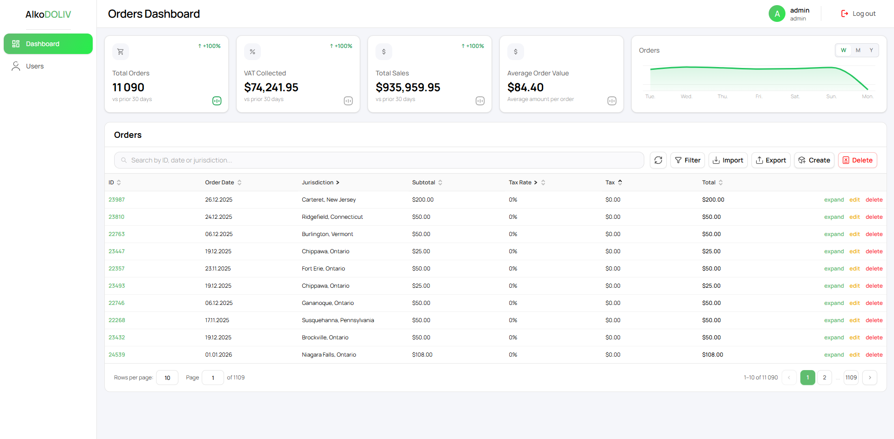
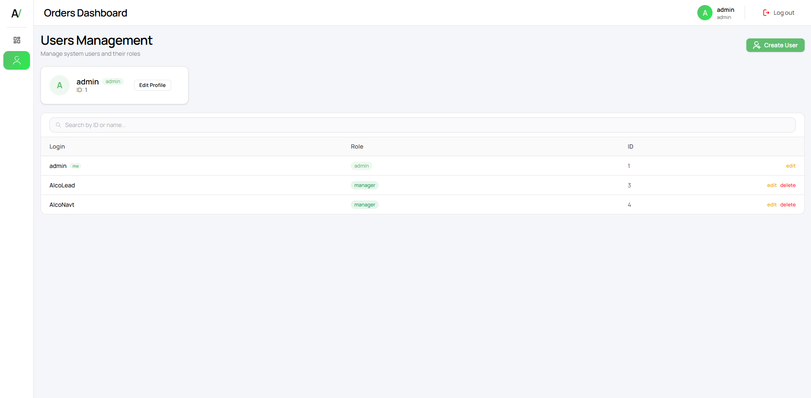
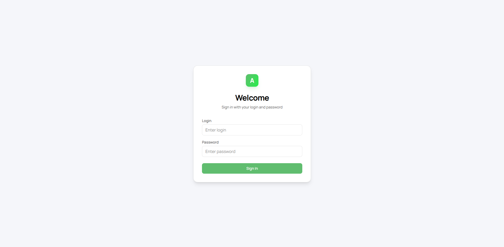
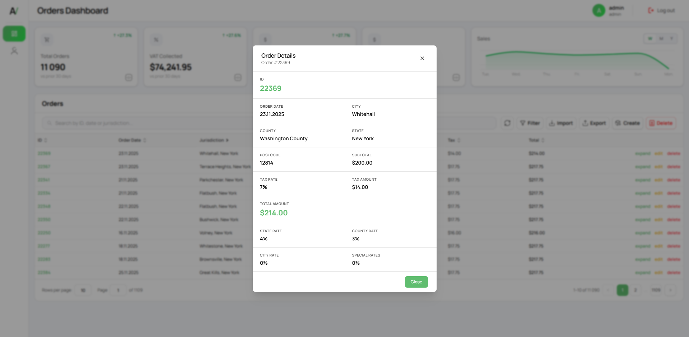

# AlcoDOLIV: Tax Calculation System https://alco-team.ddns.net/

<div align="left">
    
</div>


## Бізнес-проблема та її вирішення
Компанія Instant Wellness Kits зіткнулася з проблемою розрахунку податків на продаж (Sales Tax) під час швидкого масштабування сервісу доставки дронами в штаті Нью-Йорк. Через специфіку податкової системи США (Composite Sales Tax = State + County + City + Special rates), було необхідно розробити надійну систему, яка б автоматично вираховувала податок на основі географічних координат (latitude, longitude) місця доставки.

**Наше рішення** забезпечує:
* **Локальне реверс-геокодування** для швидкого визначення юрисдикцій (округів та міст) без залежності від лімітів зовнішніх API.
* **Точний розрахунок** composite tax rate на основі попередньо завантажених ставок штату Нью-Йорк (State, County, City, Special/MCTD).
* **Перевірку геозони.** захист від створення замовлень поза межами штату Нью-Йорк.
* **Масштабовану і надійну архітектуру** для ручного створення замовлень та масового швидкого імпорту великих наборів CSV-даних.

## Приклади інтерфейсу
<div align="center">
  
  <p align="center"><i>Скріншот головної сторінки застосунку</i></p>

  
  <p align="center"><i>Скріншот сторінки користувачів</i></p>

  
  <p align="center"><i>Скріншот сторінки входу</i></p>

  
  <p align="center"><i>Скріншот модального вікна деталей замовлення</i></p>
</div>

## Технічний стек
* **Backend:** Node.js, Express.js, TypeScript
* **Database & ORM:** PostgreSQL, Knex.js
* **Caching & Storage:** Redis (кешування результатів геокодування та податкових ставок)
* **Frontend:** React, Vite, Tailwind CSS, TypeScript
* **Geospatial & Parsing:** Turf.js (Point in Polygon для перевірки кордонів), CSV-parse (читання статик-файлів податків)
* **Reverse Geocoder:** local-reverse-geocoder
* **Infrastructure:** Docker, Docker Compose, Caddy (Reverse Proxy для об'єднання фронтенду і бекенду)

## Архітектурні рішення та припущення
1. **Зовнішні ліміти на Geolocation API:** Оскільки безкоштовні API (такі як Nominatim) мають жорсткі Rate Limits, і масовий CSV-імпорт міг би їх порушити (що спричинить тайм-аути або HTTP 429), ми обрали та налаштували **локальний реверс-геокодер**. Він завантажується в пам'ять бази GeoNames під час старту проєкту і обробляє координати миттєво, без зовнішніх запитів. Додатково результати кешуються в Redis на 24 години.
2. **Перевірка кордонів штату (Geospatial Boundaries):** Використовується GeoJSON полігон кордонів Нью-Йорка (`ny-boundary.json`) та бібліотека Turf.js (функція `@turf/boolean-point-in-polygon`). Кожне замовлення проходить валідацію: якщо координати за межами полігону — замовлення відхиляється.
3. **Розрахунок податків:** Ставки завантажуються із наданих CSV-файлів (`states.csv`, `counties.csv`, `cities.csv`) в оперативну пам'ять на старті сервісу і мапляться за назвами локацій. Composite rate обчислюється і зберігається для віддачі. 
4. **Міграції бази даних та Seed:** Під час запуску бекенду (у `server.ts`) автоматично виконуються міграції БД Knex та автоматично створюється обліковий запис адміністратора. Вручну запускати міграції не потрібно.

## Як запустити проєкт локально

Проєкт повністю контейнеризований і піднімається з однієї кнопки.

### Вимоги
* Docker
* Docker Compose

### Кроки для запуску
1. Клонуйте репозиторій.
2. За замовчуванням усі секрети та налаштування вже підготовлені у файлі `.env`. Якщо він відсутній, створіть його в корені репозиторію з таким вмістом:
   ```env
   PORT=3000
   DATABASE_URL=postgresql://postgres:password@db:5432/wellness_orders
   DB_HOST=db
   DB_PORT=5432
   DB_NAME=wellness_orders
   DB_USER=postgres
   DB_PASSWORD=password
   JWT_SECRET=XlF/HGAOhKuTcDZ7wavhBKUg+2g7ci/eQt3HeTtykH8=
   ADMIN_LOGIN=admin
   ADMIN_PASSWORD=admin
   REDIS_URL=redis://redis:6379
   VITE_API_URL=/api
   ```

3. Запустіть проєкт через Docker Compose:
   
   **Для локальної розробки (із застосуванням local конфігів):**
   ```bash
   docker-compose -f docker-compose.yml -f docker-compose.local.yml up -d
   ```
   
   **Для розгортання на сервері:**
   ```bash
   docker-compose up -d --build
   ```
   *(Примітка: При першій збірці бекенд може скачувати дата-дамп для локального геокодера. Це займе кілька хвилин).*

4. Зачекайте 10-20 секунд, поки бази даних (PostgreSQL) та Redis ініціалізуються, а бекенд застосує табличні міграції.

### Доступ до системи
* **Web UI (Адмінка):** Відкрийте [http://localhost](http://localhost) у вашому браузері.
* **Бекенд/API:** Доступні через той самий порт за префіксом `http://localhost/api`. 

> Завдяки контейнеру **Caddy** вирішено проблему CORS: і фронтенд і бекенд доступні через один хост.

### Авторизація
Захист доступу успішно впроваджено (JWT). Для доступу до адмінки використайте наступні креденшіали (створюються автоматично під час ініціалізації БД):
* **Username:** `admin`
* **Password:** `admin`

## API Документація (Swagger)
Документація доступна за адресою після запуску Docker:
👉 [http://localhost/api/api-docs](http://localhost/api/api-docs)

**Основні ендпоінти:**

**Auth**
* `POST /api/auth/login` — Отримання JWT токена для доступу.

**Orders**
* `POST /api/orders/import` — Завантаження CSV файлів з замовленнями.
* `GET /api/orders/stats` — Отримання агрегованої статистики замовлень.
* `POST /api/orders` — Створення замовлення вручну.
* `GET /api/orders` — Отримання списку замовлень.

**Users**
* `GET /api/users` — Отримання списку всіх користувачів.
* `POST /api/users` — Створення нового користувача.
* `DELETE /api/users/{id}` — Видалення користувача за ID.
* `PATCH /api/users/me` — Оновлення власного логіна або пароля.

---
## Цікавинки та Особливості
* **Назва команди**: **AlcoTeam**. Означає саме те, що ви подумали, і допомагає нам переживати ці довгі та муторні ночі програмування! ☕*(не зовсім кава)*.
* **Анти-Податкова Інфраструктура (Anti-IRS system)**: Оскільки наш проєкт повністю контейнеризований у Docker, якщо нами серйозно зацікавиться податкова служба - ми просто пропишемо `docker-compose down` і зникнемо в тумані Нью-Йорка
* **Стрес-тестування**: Жоден дрон чи житель Нью-Йорка не постраждав під час розробки. Чого не скажеш про нервові клітини та режим сну розробників AlcoTeam...
